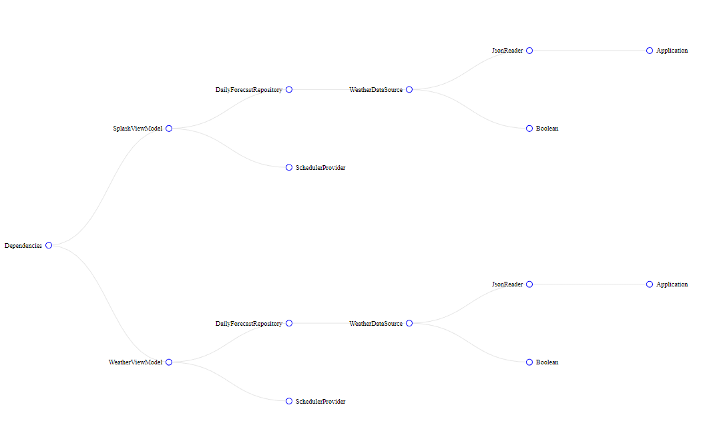
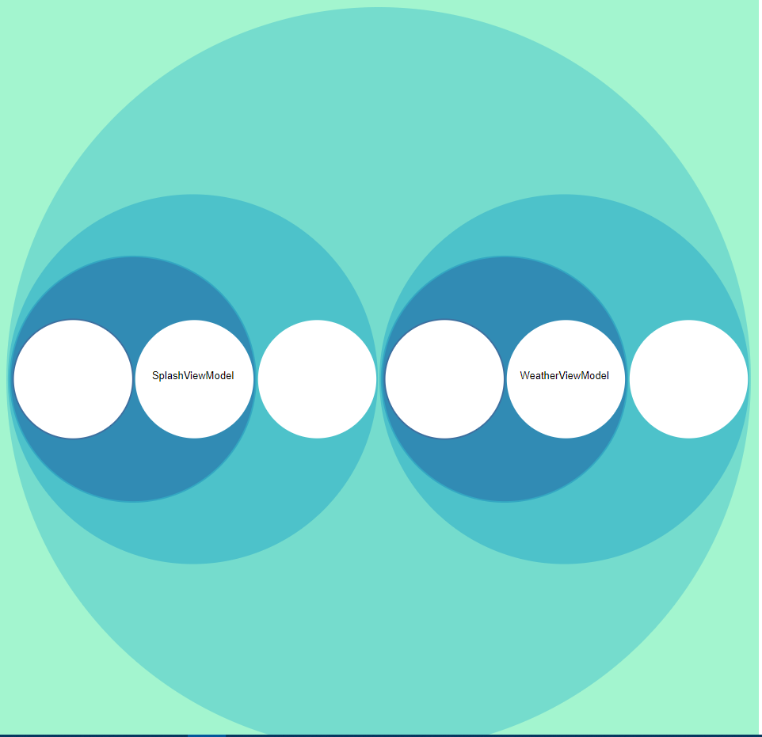
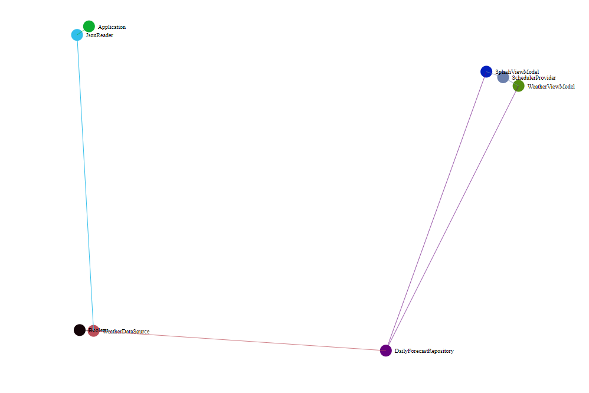

# KoinGraph
Graph generator for android projects using [Koin](https://github.com/InsertKoinIO/koin)

### KoinGraph in Action

  
  
  

### Why use this?
- This can serve as your project documentation
- New devs can easily identify the flow of features/functionalities
- Identify those classes that will be affected when you change/update dependency

### How to use
- clone this repository
- type `npm install`
- type `node index --path path\to\android-project\using\koin`

### Encountering Issues
- If you encounter any issues, feel free to reach out by creating an issue. Please provide the format on how you register your modules in Koin so we can easily identify the problem.
  
### Running Tests
`npm test`
- this will run all tests on `/test` folder

### Limitations (To Do)
- Reflection

### Inspirations
- [Koin](https://github.com/InsertKoinIO/koin) - Of course, specially to [arnaudgiuliani](https://github.com/arnaudgiuliani) for hearing my request. [Issue Link](https://github.com/InsertKoinIO/koin/issues/479)
- [daggraph](https://github.com/dvdciri/daggraph) - Graphs are heavily inspired in this project

### Author
Exequiel Egbert V. Ponce, poncetenten10@gmail.com
